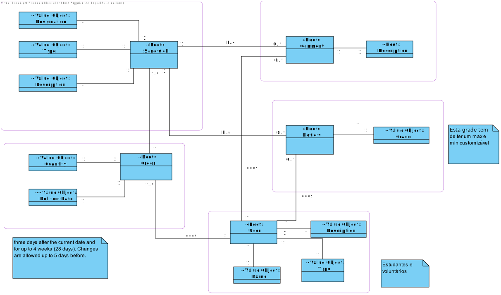
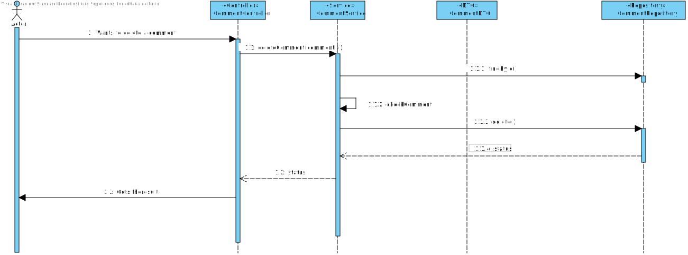

# Activity 1

**Use Cases**

**UC1 - Manage unsold sandwiches** Volunteers are responsible for collecting unsold sandwiches.

**UC2 - Add a sandwich** School staff can add sandwiches.

**UC3 - Delete sandwich** School staff can delete sandwiches.

**UC4 - Order sandwiches** Students can make an order.

**UC5 - Edit order** Students can edit their own previously made orders.

**UC6 - Make a comment** Students can comment on a sandwich.

**UC7 - Delete a comment** Students can delete their comments.

**UC8 - Review a sandwich** Students can review sandwiches they ordered.

**UC9 - Delete review** Students can delete their reviews.

 

**Quality Attribute Scenarios**

**QA1 - Usability** The application should be accessed through a browser [ALL]

**QA2 - Reliability** There should exist 2 persistance models in order to avoid data loss in case of failure [ALL]

**QA3 - Security** A sandwich can only be reviewed if it was ordered by the reviewer [UC7]

**QA4 - Usability** At least 2 different languages should be supported (English and Portuguese) [ALL]

**QA5 - Modifiability** Some attributes can be configurable, that is, can be modified without affecting other System Components [ALL]

 

**Constraints**

**CON-1** The application should be accessible through a browser.

**CON-2** The application should be developed in 5 weeks;

**CON-3** The application should be deployed on a Virtual Machine or a Docker.

**CON-4** The application should be executed on the command line.

**CON-5** The GUI should show the sandwiches, and the respective comments and reviews.

**CON-6** It is recommended that the backend API should be accessable via a single page frontend.

**CON-7** The application should be ready to work with Spring Data JDBC and Spring Data JPA.

**CON-8** The application should support internationalization.

**CON-9** The application should be developed using open-source technologies.

 

**Architectural Concerns**

**CRN-1** Ensure that only the person whom ordered the sandwich, can review it.

**CRN-2** Conceabe an initial architectural model.

**CRN-3** Leverage on the team's knowledge regarding JPA, JDBC, Java, Angular and Spring.

**CRN-4** Split the workload by the team members.

 

**Greenfield Roadmap**

 

# Activity 2

**STEP 1**

|   Scenario ID	|   Importance to the customer	|   Difficulty of implementation according to the architect	|
|:---:	        |:---:	                        |:---:	    |
|   QA-1	    |   High                    	|   Low	    |
|   QA-2	    |   Medium	                    |   High	|
|   QA-3	    |   High                        |   Medium	|
|   QA-4	    |   High                        |   Medium  |
|   QA-5	    |   High                        |   Medium  |

 

|   Category	|   Details	|
|:---	|:---	|
|   Design Purpose	|   This is a greenfield system from a mature domain is to be developed and it is necessary to produce a sufficiently detailed design to support the construction of the system	|
|   Primary	functional requirements| **UC2, UC3, UC4, UC6, UC8**   Because they all support the core business 	|
|   Qualitty attribute scenarios	|   **QA-1, QA-3, QA-4, QA-5**   In accordance with the priority data table above	|
|   Constraints	|   All the constraints previously presented are included as drivers	|
|   Architectural concerns	|   All of the architectural concerns previously presented are included as drivers	|

 

**ITERATION 1**

 

**STEP 2**

Goal: This iteration is driven by a general architectural concern, therefore the architect must keep in mind the following drivers that may influence the general structure of the system:

- QA-1: Usability
- QA-2: Reliability
- CON-1: The system must be accessed through a web browser.
- CON-6: The Backend API should be accessed via a single-page Frontend.
- CON-7: The system must be ready to work with Spring Data JDBC and Spring Data JPA.
- CRN-2: Conceive an initial Data Model.
- CRN-3: Leverage the team's knowledge regarding Java technologies

 

**STEP 3**

The element to refine is the entire system, taking into consideration that there are:
- User workstations
- Database server
- Backend server

 

**STEP 4**

|   Design Decisions and Location  |    Rationale  |
|:---|:---|
|   Logically structure the client part of the system using the **Web Application** architecture| The **Web Application** architecture is oriented to the development of applications that are accessible throught the browser (CON-1). Because of this constraint, **Mobile** and **Rich Client Applications** architectures were **discarded**. The **Rich Internet Application** architecture was also **discarded** because the deadline to deliver was short and in order to achieve it, there was the need to rely on the team's technical experience  (CRN-3, CON-2). |
|   Logically structure the server part of the system using the **Service Application** architecture  | **Service Applications** do not provide a user interface, however they do provide services that are consumed by other applications. No other alternatives were considered as this architecture met the requirements. |
|   Logically structure the server part of the system using the **Model-View-Controller** pattern     | **MVC** splitsthe code into 3 independant groups (UI, Logic and Data Model) this way a small change in the UI doesn't necessarily affect the logic. As a consequence, this provides code Maintainability (QA4) and Upgradability. For this reason, **MVC** was chosen and no other alternatives were considered.                                                                                    |   |
|   Use of the **Data Transfer Object** pattern to aggregate data transfered  | The object known as **DTO**, aggregates all the data needed, from a single or multiple sources. This way only the necessary data is transferred in a single request, which aids the entire system performance. For this reason, this pattern was chosen.                                |
|   Use of the **Repository** pattern on the server part of the system    | The repository pattern is a way to encapsulate the DB access operations, which provides code reusability and a more object-oriented view of the data source. Since the team was familiarized with this pattern, and the short development deadline, other alternatives were discarded.|
|   Build the user interface Web Application using Angular| Given the team was already familiarized with this technology and the short deadlines(CRN-3, CON-2), no other alternatives were considered.|

 

**STEP 5**

|   Design Decisions and Location  |    Rationale  |
|:---|:---|
|   All the data sources should be hosted on a remote server| Given that the system is intended to be accessed by multiple users simultaneously, the data should be centralized, therefore the database and backend server should be hosted on a remote server.|

 

**STEP 6**

**Deployment Diagram**

A docker container containing the application front end and back end communicates through TCP with the database server. Within docker container, the *GorgeousSandwichUI* communicates with the *GorgeousSandwichBE* through a REST API.

**Component Diagram**

The *GorgeousSandwichUI* through a REST API with the *Controller* which is the entry-point to the back end. Then the *Controller* passes the data to the *Service* which is responsible to apply the business logic. If data transactions are required, the *Service* communicates with the *Repository* which it´s sole purpose is to execute the data transactions with the *database*. Each of this layers can only communicate according to the connections shown on the diagram. The *DTO* encapsulates only the essential data from the model in order to reduce the ammount of data trasnfered between layers.

 

**STEP 7**

|   Not Addressed | Partially Addressed| Completely Addressed| Design decisions made during the iteration|
|:---:|:---:|:---:|:---|
|   | UC2  |   | Selected reference architecture establishes the modules that will support this functionality  |
|   | UC3  |   |  Selected reference architecture establishes the modules that will support this functionality |
|   | UC4  |   |  Selected reference architecture establishes the modules that will support this functionality |
|   | UC5  |   |  Selected reference architecture establishes the modules that will support this functionality |
|   | UC8  |   |  Selected reference architecture establishes the modules that will support this functionality |
|   |   | QA1  |  It was decided to use angular the Web Application architecture implemented with Angular|
| QA2  |   |   | No decisions were mad at this point  |
|   |   | CON-1 | It was decided to use angular the Web Application architecture implemented with Angular |
|   | CON-6  |   | After some thought during the iteration 1 this constraint should be addressed in the 2nd iteration  |
|   | CON-7  |  | JPA was implemented  |
|   | CRN-2   |  | An initial data model was partially created  |
|   |   | CRN-3  | The team knowledge was used to define the initial architectural design decisions  |

 

**ITERATION 2**

 

**STEP 2**

GOAL: The goal of this iteration is to address the general architectural concern of identifying structures to support
primary functionality.

Identifying these elements is useful for understanding how functionality is
supported, and also for addressing CRN-4.

In this second iteration, the following concern and primary use cases:

**UC2 - Add a sandwich** School staff can add sandwiches.

**UC3 - Delete sandwich** School staff can delete sandwiches.

**UC4 - Order sandwiches** Students can make an order.

**CRN-4** Split the workload by the team members.

 

**STEP 3**

The elements to be refined in this itereation are the modules defined in the previous iteration which are located in different layers.

 

**STEP 4**

|   Design Decisions and Location  |    Rationale  |
|:---:|:---:|
|   Create a **Domain Model** for the application | It is essential to create an initial domain model of the system, identifying the entities in the domain, as well as the relationships between them, before the functional decomposition. This is a necessary step as Domain Model must be eventually created, otherwise the system will be based on an improvised architecture. |
|   Identify **Domain Objects** that map to functional requirements|Each distinct functional element of the application needs to be encapsulated in a self-contained building block, which translates into a domain object.|
|   Decomposition **Domain Objects** into general and specialized Components|Domain objects represent complete sets of functionality, but this functionality is supported by more detailed elements located within the layers. The “components” in this pattern are what we have referred to as module. There are no good alternatives to decomposing layers into modules to support functionality.|
|   Use of Spring Boot and Hibernate frameworks| Spring is a widely used framework that allows build web applications using java and support MVC pattern. Hibernate is an object to relational mapping (ORM) frameworkthat integrates well with Spring. No other alternatives were considered as the team was already familiar with both of these frameworks.|

 

**STEP 5**

The folowing table summarizes the instantiation design decision.

|   Design Decisions and Location  |    Rationale  |
|:---:|:---:|
|   Create an initial domain model|The entities that participate in the primary use cases need to be identified and an initial domain model is created, to accelerate the design phase.|
|   Map the system use cases todomain object| An initial identification of domain objects can be made by analyzing the system use cases. To adress CRN-4, domain objects are identified for all the use cases.|
|   Decompose the domain objects across the layers to identify layer-specific modules with an explicit interface| This technique ensures that modules that support all of the functionalities are identified.|
|   Associate frameworks with amodule in the data layer| ORM mapping is encapsulated in the modules that are contained in the data layer. The Hibernate framework previously selected is associated with these modules|

**STEP 7**

|   Not Addressed | Partially Addressed| Completely Addressed| Design decisions made during the iteration|
|:---:|:---:|:---:|:---|
|   |  | UC2   |  API endpoint and respective logic created  |
|   |  | UC3   |  API endpoint and respective logic created |
|   |   | UC4  |  API endpoint and respective logic created |
|   |   | UC5  |  API endpoint and respective logic created |
|   |   | UC8   |  API endpoint and respective logic created |
|   | QA2  |   | Only one persistance data model was implemented at this point  |
|   |  | CON-6   | A single page web app was implemented using Angular  |
| CON-7  |   |  | JPA framework was used in order to take advantage of ORM   |
|||CRN-2| The domain model was completed|
|||CRN-4| The workload was split between the team members after some discussion|

 

**Domain Model**

We started by defining the entities of the Sistem: Sandwich, User, User, Comment, Review. We decided that each entity refered should be the root of it´s aggreggate.
As it was purposed, the Sandwich is defined by a designation, a description and the type.
The user is defined by it´s name, description (with some key information) and a type. This type is characterized by a boolean. The user can be the student or a volunteer. When this boolean is true it means that it´s an user and when it´s false is a volunteer.
Next, we defined the Order section. The order is defined by a collection of sandwichs and the respective quantities, by the delivery date and by the user that wants to make the order. The Delivery Date has it´s own rules. It can only be defined to a date after 3 days of the day of the order and up to 28 days after as well. This date can only be change if the delivery date is not up to 5 days before. We decided that this order will be structured with 2 collections with the sandwiches and the quantities as explained because it would be easier to implement. To check that everyting goes accordingto the plan, we also check that those collections have the same size to confirm that nothing goes wrong.
After that we also have the comment section. This  applies to when the user wants to comment a sandwich. The comment is characterized with a description. Each comment has the user that makes it and the sandwich that it refers.
And last, there is also the review section which is defined by a grade. The grade can only be within a minimal Grade and maximal Grade. This minimal and maximal grade can be configurable.One more thing that is a concern is that only users that ordered the sandwich refered to this review can review the sandwich. The review has the user that wants to review the sandwich, the sandwich and the grade.

 

#### **Sequence Diagrams**  
Next we will show some examples of Sequence Diagrams of the use cases defined at the beginning of this document. We will show an example of each request (POST, PUT, GET, DELETE).

 

**Sequence Diagram - POST**

This sequence diagram serves as an example of all the POST requests made on this project. In this case it refers to the creation of an order.
The *OrderController* receives from the front end component the json that has all the values needed. The *OrderController* refers to *OrderService* that starts to create *OrderDTO* object with the values on json. With the object we start doing the verifications on the *OrderService*. In this case we start to verify if the User exists on the system, then if the all the sandwichs exist on the system, then if the collection of the sandwichs has the same size of the collection of the quantities. Finally we do the last verification of the delivery Date. We start by verifiying if the delivery Date complies with all requirements, can only be defined to a date after 3 days of the day of the order and up to 28 days after as well.
If there are no errors on the validation process, then we create a *Order* object with all the attributes and finally we save to the database the new *Order* using *OrderRepository*.
Before it ends, the status is returned to the client.

 

**Sequence Diagram - PUT**

This sequence diagram serves as an example of all the PUT requests made on this project. In this case it refers to the change of an order.
The *OrderController* receives from the front end component the json that has all the values needed. The *OrderController* refers to *OrderService* that starts to create *OrderDTO* object with the values on json. With the object we start doing the verifications on the *OrderService*. In this case we start to verify if the Order exists on the system,if the User exists on the system, then if the all the sandwichs exist on the system, then if the collection of the sandwichs has the same size of the collection of the quantities. Finally we do the last verification of the delivery Date. We can only change the delivery date of an order if the date that the user is changing is at least 5 days before the initial Date. Only then we can proceed to change all the information. This change is made at the *OrderService*.
then we create a *Order* object with all the attributes and finally we save to the database the *Order* changed using *OrderRepository*.
Before it ends, the status is returned to the client.

 

**Sequence Diagram - GET**

This sequence diagram serves as an example of all the GET requests made on this project. In this case it refers to getting all the sandwiches from the system.
The request pretending to get all the sandwiches gets to *SandwichController*. Then a process getting all the sandwiches is made to *SandwichService*. The *SandwichService* makes the findall() method to the *SandwichRepository* getting all the Sandwiches that exist on the system.
For each Sandwich returned from the database, we transform it into a *SandwichDTO* object and the we return to the client the list of *SandwichDTO* objects.

 

**Sequence Diagram - DELETE**

This sequence diagram serves as an example of all the DELETE requests made on this project. In this case it refers to deleting a comment existing on the system.
The request pretending to delete a comment gets to *CommentController*. Then a process finding the comment is made to *CommentService*. The *CommentService* makes the findById() method to the *CommentRepository* getting the comment that wants to delete.
If all goes according to the plan, the status is returned.

 

# Activity 4

**ATAM**

| Scenario: **QA-1**  |  The application should be accessed through a browser |
|:---|:---|
|  Attribute | Usability  |  
|  Environment |  Normal system operation |  
| Stimulus| The application is working on a server and accessible to the users
|Response  | The application execution is done through browsers
|Reasoning|The application has an URL that allows the users to acess through every technology tha has access to a browser
|Risk|Low|

 

| Scenario: **QA-2**  |  Should have 2 persistency models that can back each other  |
|:---|:---|
|  Attribute | Reliability  |  
|  Environment |  Normal system operation |  
| Stimulus| To have a backup working data model in case of failure
|Response  | Have 2 different persistency data models
|Reasoning| Use the backup persistency data model in case of failure
|Risk|  Medium|

 

| Scenario: **QA-3**  |  Only people that ordered a specific sandwich can review it |
|:---|:---|
|  Attribute | Security  |  
|  Environment |  Normal system operation |  
| Stimulus| An User wants to review a sandwich
|Response  | The user reviews a sandwich
|Reasoning|The apllication checks if the user has ordered that sandwich, and only let it review it if the user had at anytime ordered it.
|Risk|High|

 

| Scenario: **QA-4**  | Should support at least two different languages (Portuguese and English)  |
|:---|:---|
|  Attribute | Usability  |  
|  Environment |  Normal system operation |  
| Stimulus| The User wants to change the language of the application
|Response  | The User selects in which language wants to see the information
|Reasoning|The application shows all the information of the application on the language selected
|Risk|Low|

 

| Scenario: **QA-5**  | Some attributes must be configurable, changes must not change the other components of the system  |
|:---|:---|
|  Attribute | Modifiability  |  
|  Environment |  Normal system operation |  
| Stimulus| Some attributes must be configurable
|Response  | The user Selects the date that wants the sandwich to be delivered on
|Reasoning|The application checks if the new Date is between the configurable Dates. This dates are configurable and do not interfer with the rest of the application
|Risk|Medium|

 
