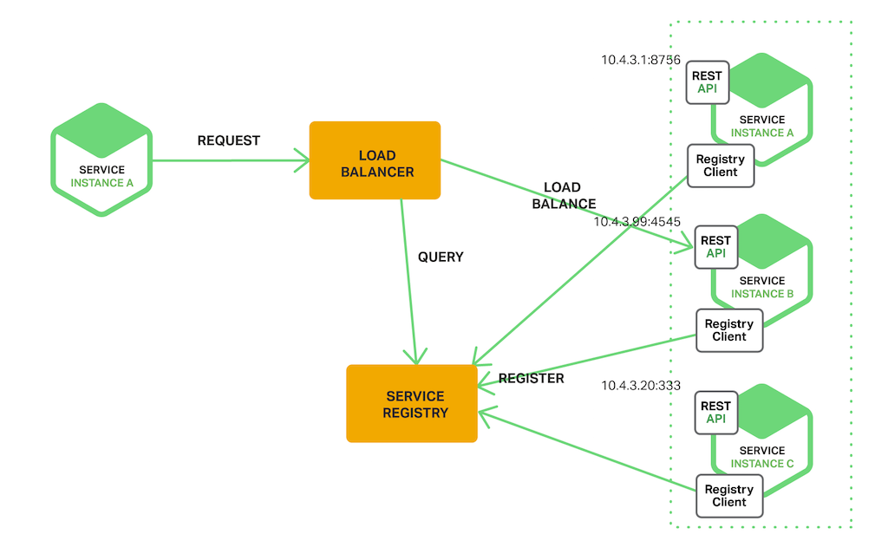

**Use Cases**

**UC1 - Manage unsold sandwiches** Volunteers are responsible for collecting unsold sandwiches.

**UC2 - Add a sandwich** School staff can add sandwiches.

**UC3 - Delete sandwich** School staff can delete sandwiches.

**UC4 - Order sandwiches** Students can make an order.

**UC5 - Edit order** Students can edit their own previously made orders.

**UC6 - Make a comment** Students can comment on a sandwich.

**UC7 - Delete a comment** Students can delete their comments.

**UC8 - Review a sandwich** Students can review sandwiches they ordered.

**UC9 - Delete review** Students can delete their reviews.

<br>

**Quality Attribute Scenarios**

**QA1 - Usability** The application should be accessed through a browser [ALL]

**QA2 - Maintainability** The application should have a microservice architecture [ALL]

**QA3 - Portability** Application deployment based on containers [ALL]

<br>

**Constraints**

**CON-1** Each microservice must have its own database.

**CON-2** Local method calls must be replaced by synchronous remote calls.

**CON-3** Only open-source technologies can be adopted.

**CON-4** Direct dependencies between databases to be eliminated depending on the adopted data management strategies.

**CON-5** The application should be accessible through a browser.

<br>

**Architectural Concerns**

**CRN-1** Leverage the team's knowledge about Microservices technologies.

**CRN-2** Leverage the team's knowledge about decomposing a monolitic application to a microservice application.

**CRN-3** Allocate work to members of the development team.
**CRN-4** Leverege on the team's knowledge about the Docker technology.

<br>

**Roadmap**


<br>

# Activity 2


**STEP 1**


|   Scenario ID	|   Importance to the customer	|   Difficulty of implementation according to the architect	|
|:---:	        |:---:	                        |:---:	    |
|   QA-1	    |   High                    	|   Low	    |
|   QA-2	    |   High	                    |   High	|
|   QA-3	    |   High                        |   High	|

<br>

|   Category	|   Details	|
|:---	|:---	|
|   Design Purpose	|   This is a brownfield system in a mature domain. The purpose is to design the next system release.	|
|   Primary	functional requirements| **UC2, UC3, UC4, UC6, UC8** <br> Because they all support the core business 	|
|   Qualitty attribute scenarios	|   **QA-1, QA-2, QA-3** <br> In accordance with the priority data table above	|
|   Constraints	|   All the constraints previously presented are included as drivers	|
|   Architectural concerns	|   All of the architectural concerns previously presented are included as drivers	|

<br>

**ITERATION 1**


<br>


**STEP 2**

Goal: This is the first and only iteration because the goal is to modify the existing design to support all the new drivers.
To support the new architecture (QA2), the team must keep in mind all of the drivers that may influence, but only a limited number of drivers need to be adressed, specially the new ones. We selected the following:

- QA2: Maintainability
- QA3: Portability
- CON-1: Each microservice must have its own database
- CON-2: Local method calls must be replaced by synchronous remote calls
- CON-4: Direct dependencies between databases to be eliminated depending on the adopted data management strategies
- CRN-1: Leverage the team's knowledge about Microservices technologies
- CRN-2: Leverage the team's knowledge about decomposing a monolitic application to a microservice application
- CRN-4: Leverege on the team's knowledge about the Docker technology


<br>

**STEP 3**

The entire System needs to be refined. The existing monolithic architeture needs to be decompose into a microservices architeture to suport the selected drivers.


<br>

**STEP 4**

|   Design Decisions and Location  |    Rationale  |
|:---|:---|
|   Use of the **Web Application** architecture| The **Web Application** architecture is oriented to the development of applications that are accessible throught the browser (CON-5). Since there were no requirementes that needed a **Rich Internet Application**, this architecture was discarded because it would need additional effort from the team. |
|  Use of a **Microservice** based architecture|  A **Microservice** architecture consists of a set of loosely coupled and collaborative services, that are highly maintainable and independetly deployable. Given this was a client request, no other options were considered. A further analysis on this architecture can be found in [here](#microservices). |
| Use of the **Circuit Breaker** pattern  | The **Circuit Breaker** pattern prevents an application from preforming requests are likely to fail, and subsequently waste it's resources, by triggering a timeout after a threshold of failing requests has been crossed, during which these requests won't be processed. After the timeout expires, the blocked requests will be processed once again, unless they keep failing. |
|  Deployement based on **Docker containers** |  A container is a unit of software that packages up code and all its dependencies, providing abstraction from the hardware and OS, so the application runs quickly and reliably from one computing environment to another. In order to leverage on the team's knowledge (CRN-3), Docker was the technology chosen to containerize the solution. Further info regarding the implementation can be found [here](#docker). |
| Use of the **API Gateway** pattern | An API gateway takes all API calls from clients, then routes them to the appropriate microservice with request routing and composition. In its simplest use case it typically handles a request by invoking multiple microservices and aggregating the results, to determine the best path, which is a desired operation in order to avoid code complexity, hence why it was the considered option.  |
| Use of the **Service Discovery** pattern | In a microservice architecture, service instances have dynamically assigned network locations. In order to have coomunication between the services and the clients, there is the need to discover each service network location. To achieve this, we opted for the **Server Side discovery pattern** in order to integrate have better integration with API gateway. Regarding the **Service Registry**, we opted for the **Third Party registration pattern** in order to reduce code complexity and the amount of failure points a service could have. A more detailed analysis can be found in [here](#service-discovery). |
| Use of a **Database per Service** pattern  |  A Microservice based architecture raises the question of which kind of DB pattern should be used. **DB per service** or **Shared DB**. A shared DB ensures data consistency across of all services but as downside it has tight coupling between each microservice. On the other hand, a DB per service allows to have the most suitable type of DB according to the purpose of each service and also ensures loose coupling. But as a drawback, the implementation of business transactions that span accross multiple services create additional complexity. In order to respect the CON-1 and CON-4, the DB per service approach was selected.  |


<br>

**STEP 5**
 
 In order to kachieve the decomposition of a monolithic system into a microservice architecture it is necessary to define which microservices will be  defined and its responsibilites. The definition of bounded contexts can help separating responsibilities and dividing the domain in sub-domains.

A more detailed description on how we identified the bounded contexts can be found [here](#decomposition-approach).

The following table summarizes the definitions of the considered bounded contexts: 

|   Design Decisions and Location  |    Rationale  |
|:---|:---|
| User Context| This context is responsible to manage the users. Managing users is the scope of this context.|
| Sandwich Context| This context is responsible to manage the sandwiches. In order to reduce the amount of requests between services, the Sandwich, Review and Comment management reside inside this context.|
| Order Context| This context is responsible to manage the orders. Managing orders is the scope of this context.  |

<br>

**STEP 6**

**Deployment Diagram**


|   Element	|   Responsibility	|
|:---	|:---	|
| Docker | Server that hosts the front end component, the gateway API component and all existing microservices |
| Database Server | Server that hosts the microservices databases |
| School Workstation | Server used by the school to use the application via web browser |

<br>

|   Relationship	|   Description	|
|:---	|:---	|
|Between the docker server and School Workstation| The docker server is served through HTTP requests to the School Workstation |
|Between the docker server and the database server| Is used Tcp between these two servers |

<br>

Each microservice has its own database according to the microservices pattern which makes each microservice independent.

**Component Diagram**


|   Element	|   Responsibility	|
|:---	|:---	|
|GorgeousSandwichUI| Contains all the visual elements and components of the UI website |
|GorgeousSandwichApiGateway| Responsible to route the requests to the respective microservice|
|GorgeousSandwichUser| Responsible to manage the users|
|GorgeousSandwichSandwich| Responsible to manage the sandwiches and respective comments and reviews|
|GorgeousSandwichOrder| Responsible to manage the sandwiches orders|

A further explanation can be found [here](#decomposition-approach).

<br>

**Bounded Contexts**

The following diagrams show the multiple contexts used in the decomposition of the old monolithic application into microservices. All these bounded contexts were decomposed based on their responsabilities and business logic.

***User Context***


|   Element	|   Description	|
|:---	|:---	|
|User|The entity that represents the User|
|Name|The Value Object that represents the Name of the User|
|Description|The Value Object that represents the Description of the User|
|Type|The Value Object that represents the Type of the User (If is a student or volunteer)|

<br>

***Sandwich Context*** 


|   Element	|   Description	|
|:---	|:---	|
|Sandwich|The entity that represents the Sandwich|
|Designation|The Value Object that represents the Designation of the Sandwich|
|Type|The Value Object that represents the Type of the Sandwich (Salty or Sweet) |
|Description|The Value Object that represents the Description of the Sandwich|
|Comment|The entity that represents the Comment|
|Description|The value Object that represents the description of the Comment|
|Review|The entity that represents the Review|
|Grade|The value Object that represents the Grade of the Review|

<br>

***Order Context***


|   Element	|   Description	|
|:---	|:---	|
|Order|The entity that represents the Order|
|Quantity|The value Object that represents the Quantity of the Order|
|DeliveryDate|The value Object that represents the Delivery Date of the Order|


<br>

**STEP 7**

|   Not Addressed | Partially Addressed| Completely Addressed| Design decisions made during the iteration|
|:---:|:---:|:---:|:---|
|   |   | UC1  |  API endpoint and respective logic created. The UC has been succesfully implemented |
|   |   | UC2  |  API endpoint and respective logic created. The UC has been succesfully implemented |
|  |   |   UC3 |  API endpoint and respective logic created. The UC has been succesfully implemented |
|   |   | UC4  |  API endpoint and respective logic created. The UC has been succesfully implemented |
|   |   | UC5  |  API endpoint and respective logic created. The UC has been succesfully implemented |
|   |   | UC6  |  API endpoint and respective logic created. The UC has been succesfully implemented |
|   |   | UC7  |  API endpoint and respective logic created. The UC has been succesfully implemented |
|   |   | UC8  |  API endpoint and respective logic created. The UC has been succesfully implemented |
|   |   | UC9  |  API endpoint and respective logic created. The UC has been succesfully implemented |
|   |   | QA2 |  The microservice architecture was implemented with success, using the Subdomain technique and all it´s steps|
|   |   | QA3  |  The application was deployed based on containers with success. Each microservice and UI was deployed in different containers |
|   |   | CON-1 | Each microservices has it´s own database according to the pattern. It was implemented with sucess |
|   |   | CON-2  | The communication between the several layers of the application is made via HTTP requests |
|   |   | CON-4 | Each microservice has it´s own database in order to have loose coupling |
|   |   | CRN-1 |  The team knowledge was used to define the architectural design decisions |
|   |   | CRN-2  | The team knowledge was used to define the architectural design decisions  |
|   |   | CRN-4  | The team knowledge was used to implement a containerized deployment approach |


<br>

## Lightweight ATAM


| Scenario: **QA-1**  |  The application should be accessed through a browser |
|:---|:---|
|  Attribute | Usability  |  
|  Environment |  Normal system operation |  
| Stimulus| The application is working on a server and accessible to the users
|Response  | The application execution is done through browsers
|Reasoning|The application has an URL that allows the users to acess through every technology that has access to a browser
|Risk|Low|

<br>

| Scenario: **QA-2**  |  The application should have a microservice architecture  |
|:---|:---|
|  Attribute | Maintainability  |  
|  Environment |  Normal system operation |  
| Stimulus| The application architecture must be a microservice architecture|
|Response  | Using the decomposition by subdomain tecnhique, we divide the monolitic application to a microservice one|
|Reasoning| The School wants the change to a microservice application, however given that the whole application depends on it, it can have a significant impact |
|Risk| High|

<br>

| Scenario: **QA-3**  |  Application deployment based on containers |
|:---|:---|
|  Attribute | Portability  |  
|  Environment |  Normal system operation |  
| Stimulus| The application must be deployed on containers|
|Response  | Using docker containers so we can deploy the different services|
|Reasoning|Ensures a smoother deployment process, but might have complex implementation depending on the service|
|Risk|Medium|

<br>

# Analysis

## Microservices 
The Microservices architecture have become very popular over the past few years. This architecture was one solution that the monolitic aproach presented. 
Microservices are a way of breaking large software projects into a set of loosely coupled collaborative services that are maintainable and easy to work with. Each module can communicate through simple Application Programming Interfaces.
As it was said, this architecture has become really popular and really well known companies use it to develop thei software, as per example Netflix, Amazon, Ebay etc..
So the monoservice architecture has some really positive points as:

* Improved fault isolation - Larger applications can remain active if one of the modules fail.
* More flexibility - Provide flexibility to try new technologies in different services as multiple languages or frameworks.
* Ease of understanding - Developers can understand with more ease the funcionalities of each service because of the smaller size of the modules
* Deployments - Smaller and faster deployments and possibility of continous deployment
* Scability - Since each service is separate, it´s easier to escalate the application.

Despite all it´s positives, it does have flaws as referred next:

* Communication between services - Since each service is independent, their communication gets a bit complex. Requests between modules need to be very weel handled and it can create some problems.
* Databases - There is the possibility that each service has it´s own database. To the application run with no problems, rhe data needs to be according to the differente databases which sometimes is harder tha expected.
* Testing - Testing gets harder because each independent service needs to be confirmed before testing occurs.
* Debug - Each service has it´s own log and sometimes there a lot to go through to find the problem.
* Large and small companies - Microservices are great for large companies with a lot of data but can be slow to implement to smaller companies who do not have the resources to implement this architecture.

<br>

## Microservice Decomposition Techniques

In order to decompose the Monolithic application into a Microservice based application, there are 2 main approaches.

<br>

### By Business Capability

As the name suggests, each service corresponds to the aggregate of business capabilities.

A business capability is something that a business does in order to generate value. For example, an online store has to, at least, manage orders and inventory. So it would have a service for order management and other for inventory management.

The main difficulty with this approach is to identify business capabilities.

<br>

### By Subdomain

Each service is defined based on the correspondant Domain-Driven Design Subdomain.

A Subdomain is a smaller portion of a Domain, which is foccused on solving a smaller problem. For example, Shopping Cart, Billing, Product Catalog are E-commerce Subdomains.

The main difficulty with this approach is to identify the subdomains.

<br>

## Decomposition Approach

Our decomposition technique was based on the decomposition by subdomain. We chose this approach because we already had a Domain model created, we could roughly visualize the subdomains. And this way we could save some time.

Based on the Domain model, we identified the subdomains. Then, we validated if the purpose of each subdomain and respective Bounded Context would make sense.

Since the Reviews and Comments are related and dependant from the Sandwiches, we decided that it made sense these 3 be inside the same Bounded Context and therefore be in the same service, which would also allow to diminuish the number of requests between services and, as a consequence, improve performance.

<br>

## Context Mapper Framework

Context Mapper is a modular and extensible modeling framework that provides a DSL to create Context Maps based on strategic Domain-Driven-Design (DDD).
Featuring these DDD patterns, its Bounded Contexts offers an approach for decomposing a domain or system into multiple independently deployable services. This framework provides transformation tools to refactor and decompose a system in an iterative way. The model behind the language and the semantic rules express the framework interpretation of the DDD patterns and how these patterns work in a consistent manner.
This framework can be integrated with **Service Cutter** that suggests new Context Maps services and Bounded Contexts with improved coupling.

We used the framework to divide the application into microservices, using a .cml file that refers the bounded contexts of the application and it´s own relationships 

````
ContextMap ContextMapper {
    contains Order
    contains Sandwich
    contains User

    Order <- User

    Order <- Sandwich

}

BoundedContext Order
BoundedContext Sandwich
BoundedContext User
````

The image that was generated using context mapper and graphviz plugins was the following:


<br>

## Service Discovery

In a application based on a microservice architecture, the running service instances can change dinamically. Instances have dynamically assigned network locations. As a consequence, for a client to make a request to a service, it muset use a service-discovery mechanism.

A key part of service discovery is the service registry which, in essence, is a database of available service instances. 

There are two main service‑discovery patterns: client-side discovery and service-side discovery. In client‑side service discovery, clients query the service registry, select an available instance, and make a request. 


> Source: https://www.nginx.com/blog/service-discovery-in-a-microservices-architecture/#more-info


On the other hand, with server‑side discovery, clients make requests via a router, which queries the service registry and forwards the request to an available instance.


> Source: https://www.nginx.com/blog/service-discovery-in-a-microservices-architecture/#more-info

Finally, there are two main ways for service instances to register and deregister from the service registry. One option is the self‑registration pattern, where service instances to register themselves with the service registry. 


> Source: https://www.nginx.com/blog/service-discovery-in-a-microservices-architecture/#more-info

The other option is for some other system component to handle the registration and deregistration on behalf of the service, the third‑party registration pattern.


> Source: https://www.nginx.com/blog/service-discovery-in-a-microservices-architecture/#more-info

<br>

## Swagger UI

Swagger reads the API´s structure and automatically builds the API documentation. Swagger creates the visual documentation making it easy for back end implementation and client side application.
It can also generate client libraries for the API in different languages and automated testing.
To implement Swagger we added the dependencies to the pom file and the the right annotations on the main class. To use Swagger we need to go to refered url : *.../swagger-ui.html*.


## Docker

As refered Docker is a unit of software that packages code and dependencies. 
For each microservice we created a dockerfile (as shown below) that creates an image for each microservice.

````
FROM openjdk:8-jre-alpine
EXPOSE 8086
ADD target/gorgeoussandwich-0.0.1-SNAPSHOT.jar app.jar
ENTRYPOINT ["java","-jar","/app.jar"]
````
This process is also done for the UI component.
After all the images are generated, a container for it´s image is created refering to each microservice and the UI, making the application deployed based on containers.

